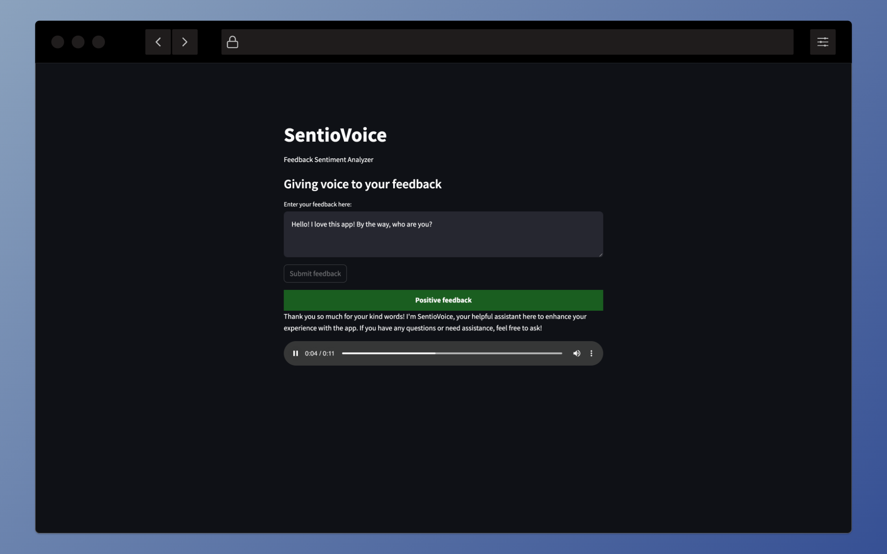
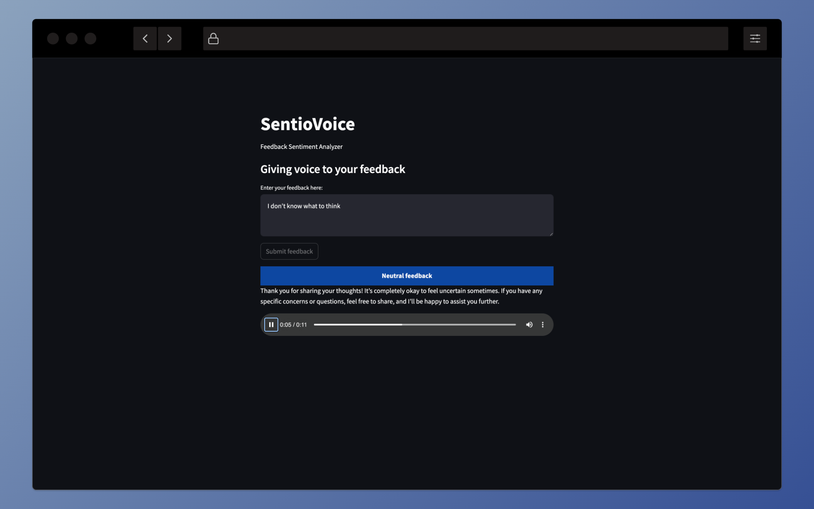
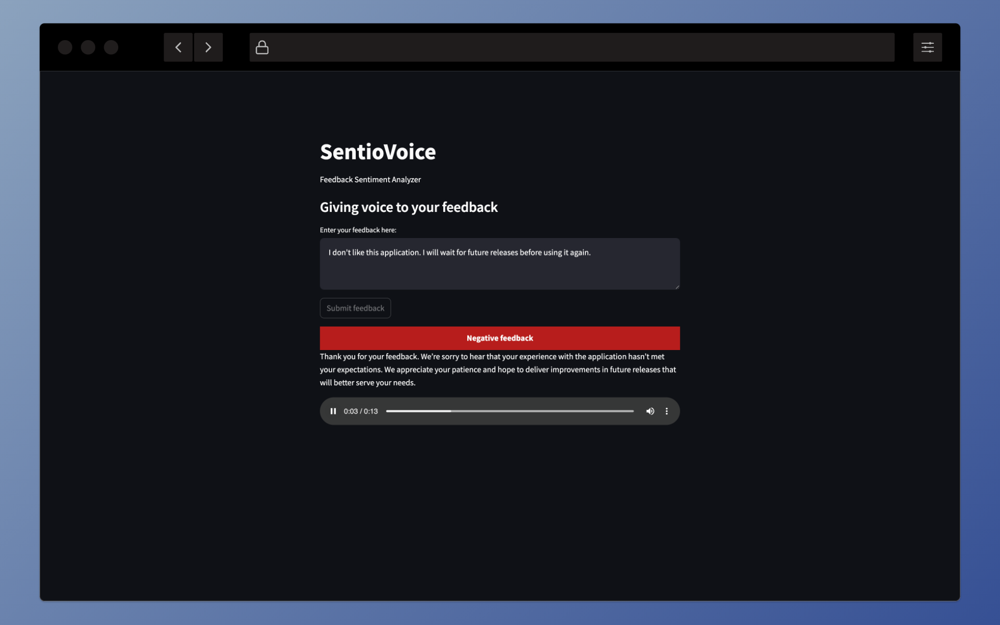

# SentioVoice

[](https://github.com/manueljesus/sentiovoice/actions/workflows/api-unit-tests.yml) [](https://github.com/manueljesus/sentiovoice/actions/workflows/ui-unit-tests.yml)


SentioVoice is an application that allows users to submit feedback, analyzes sentiment using Azure AI Services, and automatically generates responses (in both text and audio form) using a Large Language Model.


## Table of Contents

- [SentioVoice](#sentiovoice)
  - [Table of Contents](#table-of-contents)
  - [Features](#features)
  - [Demo](#demo)
    - [Response to a positive feedback](#response-to-a-positive-feedback)
    - [Response to a neutral feedback](#response-to-a-neutral-feedback)
    - [Response to a negative feedback](#response-to-a-negative-feedback)
  - [Component breakdown](#component-breakdown)
    - [Frontend (Streamlit)](#frontend-streamlit)
    - [API (Azure Functions + FastAPI)](#api-azure-functions--fastapi)
    - [Azure Cognitive Services](#azure-cognitive-services)
    - [LLM Azure OpenAI](#llm-azure-openai)
  - [Setup instructions](#setup-instructions)
    - [Development environment](#development-environment)
      - [Prerequisites](#prerequisites)
      - [Setup steps](#setup-steps)
        - [Install the dependencies](#install-the-dependencies)
        - [Configure environment variables](#configure-environment-variables)
          - [Environment variables description](#environment-variables-description)
        - [Run the application](#run-the-application)
    - [Running with Docker](#running-with-docker)
      - [Configure environment](#configure-environment)
      - [Bring the containers up](#bring-the-containers-up)
  - [Usage](#usage)

---

## Features

- **Feedback Submission**: Users can submit free-text feedback via a user-friendly interface.
- **Sentiment Analysis**: Utilizes Azure Text Analytics API to determine the sentiment (positive, negative, or neutral) of the submitted feedback.
- **Automated Response Generation**: Uses an LLM (GPT-3 or GPT-4) to generate a concise, context-aware response based on the analyzed sentiment.
- **Audio Response**: Converts the generated text response into audio using Azure Text-to-Speech (TTS) services.
- **Interactive Dashboard**: Provides a simple UI to display:
  - The submitted feedback.
  - The sentiment analysis results.
  - The generated text response.
  - An option to play or download the audio file of the response.

---

## Demo

### Response to a positive feedback


### Response to a neutral feedback


### Response to a negative feedback


---

## Component breakdown

### Frontend (Streamlit)

- Receives feedback from users.
- Displays the sentiment, text response, and audio controls.

### API (Azure Functions + FastAPI)

- Processes the feedback.
- Interfaces with Azure Cognitive Services for sentiment analysis.
- Calls the LLM API to generate responses.
- Converts text responses to audio using Azure TTS.

### Azure Cognitive Services

Provides both sentiment analysis and text-to-speech capabilities.

### LLM Azure OpenAI

Generates contextual responses based on the feedback and sentiment.



---

## Setup instructions

### Development environment

#### Prerequisites

- Python 3.11
- Poetry ^2.0
- [Azure Functions Core Tools](https://learn.microsoft.com/en-us/azure/azure-functions/functions-run-local?tabs=macos%2Cisolated-process%2Cnode-v4%2Cpython-v2%2Chttp-trigger%2Ccontainer-apps&pivots=programming-language-python)
- An **Azure account** with the following services provisioned:
  - Azure AI Services:
        - Text Analytics
        - Speech synthesis
  - Azure OpenAI service provisioned with a LLM model

#### Setup steps

##### Install the dependencies

Navigate to each project subdirectory and install the dependencies:

```bash
cd api
poetry install --with dev

cd ../ui
poetry install --with dev
```

##### Configure environment variables

Configure them based on the .env.example files:

```bash
cd api
cp .env.example .env
vim .env # Fill the variables

cd ../ui
cp .env.example .env
vim .env # Fill the variables
```

###### Environment variables description

**Streamlit:**

| Variable                        | Description                                                           |
|---------------------------------|-----------------------------------------------------------------------|
| `API_URL`                       | SentioVoice API URL.                                                  |
| `AUDIO_PATH`                    | Downloaded Audio temp path.                                           |

**API**

| Variable                        | Description                                                           |
|---------------------------------|-----------------------------------------------------------------------|
| `AZURE_OPENAI_API_KEY`          | API key for Azure OpenAI service.                                     |
| `AZURE_OPENAI_DEPLOYMENT`       | Deployed OpenAI model name.                                           |
| `AZURE_OPENAI_MODEL`            | OpenAI model (e.g., `gpt-4o-mini`).                                   |
| `AZURE_OPENAI_API_VERSION`      | Azure OpenAI API version                                              |
| `AZURE_OPENAI_ENDPOINT`         | Azure OpenAI endpoint URL.                                            |
| `AZURE_OPENAI_TEMPERATURE`      | Model temperature (e.g.; `0.7`).                                      |
| `AZURE_OPENAI_MAX_TOKENS`       | Maximum tokens for responses. (e.g.; `50`)                            |
| `AZURE_OPENAI_SYSTEM_PROMPT`    | Initial system prompt for the model.                                  |
| `AZURE_AI_SERVICES_API_KEY`     | API key for Azure AI Services.                                        |
| `AZURE_AI_SERVICES_ENDPOINT`    | Azure AI Services endpoint URL.                                       |
| `AZURE_AI_SERVICES_REGION`      | Region for Azure AI Services. (e.g.; `westeurope`)                    |
| `AZURE_AI_SERVICES_AUDIO_PATH`  | Path for storing audio files. (e.g.; `audio`)                          |
| `PROMPT_FILE`                   | Path to the prompt configuration file. (e.g.; `prompts`)                |


##### Run the application

Start the Azure functions host:

```bash
cd api
func start
```

This will launch the API at **http://localhost:7071**

In another terminal window, start the Streamlit app:

```bash
cd ui
streamlit run app.py
```

This will launch the UI at **http://localhost:8501**

### Running with Docker

The current implementation does not support setting up a development environment (i.e.; no volumes, etc.).
It is intended to be used as a deployment emulation to showcase the application.

#### Configure environment

Configure the environment in the same way as described above, with a *slight difference*:

```bash
# ui/.env
API_URL=http://api/
```

This is because a network has been defined in the `docker-compose.yml` file and the API is served there as api(i.e.; service_name):80 (default Azure Functions image configuration).

#### Bring the containers up

```
docker-compose up --build -d
```

The services will be launched in the same ports as the development environment:

- API: http://localhost:7071 (useful to check the API documentation)
- UI: http://localhost:8501
This will launch the API at http://localhost:7071
This will launch the UI at http://localhost:8501

---

## Usage

1. Open the Frontend: Navigate to the Streamlit UI (http://localhost:8501).
2. Submit Feedback: Enter your feedback in the provided text box, leave the form focus and click `Submit feedback` button.
3. Review the Results:
    - The sentiment of your feedback is analyzed and displayed.
    - A text response generated by the LLM is shown.
    - An audio version of the response is available.
        - Audio options:
            - Play: Listen to the response directly in the UI.
            - Download: Click the download button in the player menu to download the generated audio.
